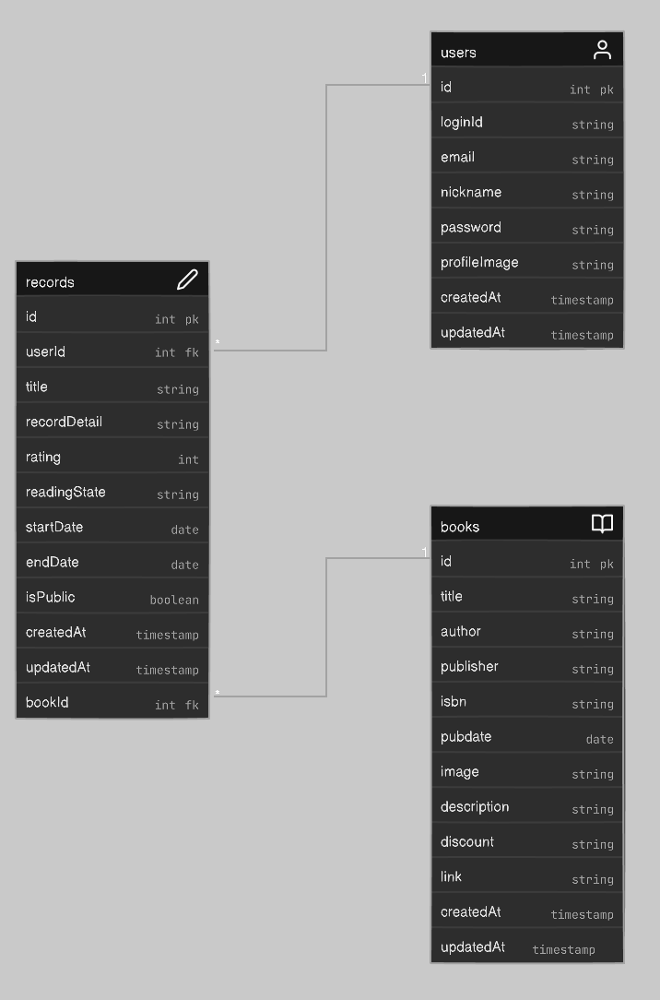

## 📖 독서 기록 플랫폼 **Chak** ✅ (API)

### [배포 화면 보러가기 🚀🚀 ](https://chak-client.pages.dev)

| 테스트 ID | tester01 |
| --------- | -------- |
| 비밀번호  | password |

## 📌 소개

독서 기록 플랫폼 Chak에서 사용되는 API입니다.

## 🛠 기술 스택

| **용도**         | **기술**                           |
| ---------------- | ---------------------------------- |
| **코어**         | Typescript, Node.js, Express       |
| **DB 및 ORM**    | MySQL, Sequelize                   |
| **보안 및 인증** | Bcrypt, Jsonwebtoken, Helmet       |
| **데이터 검증**  | Zod                                |
| **문서화**       | Swagger                            |
| **배포**         | (API) Cloudtype, (DB) Clever Cloud |

## 📊 ERD

## 📜 API 문서

[🔗 Swagger 문서 보러가기](https://port-0-chak-api-m84yv9o6d2bfcc1f.sel4.cloudtype.app/api-docs/)

## ✨ 구현 기능

### ✅ 인증

| **기능**       | **HTTP 메서드** | **엔드포인트** | **설명**                                       |
| -------------- | --------------- | -------------- | ---------------------------------------------- |
| 회원가입       | POST            | `/auth/signup` | 새 사용자 추가 및 토큰 발급                    |
| 로그인         | POST            | `/auth/login`  | 사용자 인증 및 토큰 발급                       |
| 인증 상태 확인 | GET             | `/auth/me`     | 토큰을 기반으로 현재 로그인된 사용자 정보 조회 |

- 클라이언트로부터 전달받은 사용자 정보를 DB Users 테이블에 추가하고, 조회하여 회원가입, 로그인, 로그인 상태 확인 기능 구현.
- Bcrypt로 비밀번호를 해싱하여 보안 강화.
- JWT을 사용하여 Stateless하게 사용자 인증 유지 및 확인.
- 인증 정보가 필요한 API에 공통으로 적용하기 위한 isAuth 미들웨어를 추가하여 코드 유지보수성 향상.

### 📚 독서 기록 CRUD

| **기능**                   | **HTTP 메서드** | **엔드포인트**                    | **설명**                      |
| -------------------------- | --------------- | --------------------------------- | ----------------------------- |
| 독서 기록 목록 조회        | GET             | `/records`                        | 독서 기록 조회                |
| 독서 기록 단일 조회        | GET             | `/records/{id}`                   | 해당 id를 가진 독서 기록 조회 |
| 독서 상태별 기록 개수 조회 | GET             | `/records/count/by-reading-state` | 독서 상태별 기록 개수 조회    |
| 독서 기록 생성             | POST            | `/records/`                       | 새 독서 기록 생성             |
| 독서 기록 수정             | PUT             | `/records/{id}`                   | 해당 id를 가진 독서 기록 수정 |
| 독서 기록 삭제             | DELETE          | `/records/{id}`                   | 해당 id를 가진 독서 기록 삭제 |

- 사용자의 독서 기록을 DB Records 테이블에 저장, 조회, 수정, 삭제하는 기능 구현.
- 독서 기록 목록을 조회할 때 페이징을 지원하여 성능 최적화.
  - `display`와 `start` 파라미터를 사용하여 요청마다 일정 개수의 데이터를 반환할 수 있도록 함.

### 🔎 책 검색 및 생성

| **기능**     | **HTTP 메서드** | **엔드포인트**                | **설명**                                 |
| ------------ | --------------- | ----------------------------- | ---------------------------------------- |
| 책 단일 조회 | GET             | `/books/:isbn`                | 해당 isbn을 가진 책 조회                 |
| 책 검색      | GET             | `/books/search?query={query}` | 쿼리를 기준으로 책 검색, 네이버 API 사용 |
| 책 생성      | POST            | `/books/`                     | 책 데이터 생성                           |

- 책 검색 기능을 위해 네이버 쇼핑 API 활용.
- 사용자가 선택한 책이 DB에 등록되어 있지 않다면, DB Books 테이블에 저장하고 DB에 책 정보가 존재한다면 책 정보를 반환함.
